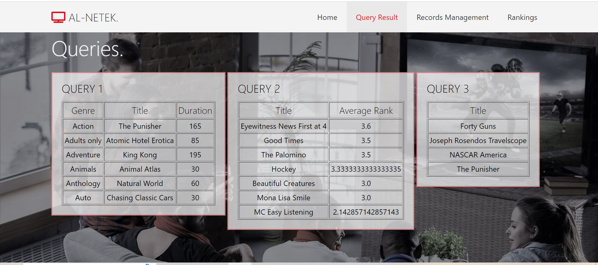
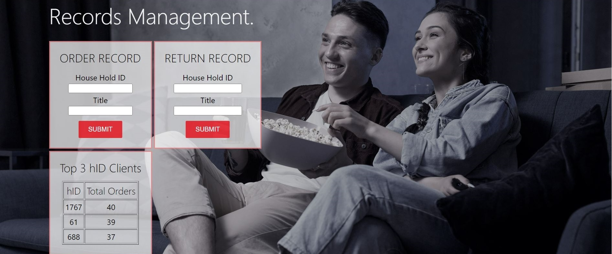

<h1 align='center' style="text-align:center; font-weight:bold; font-size:2.5em"> Media Company Website (with data base)</h1>

This project is a website built using Django, HTML, CSS, and incorporates database queries with SQL. The website facilitates recording and returning programs, as well as rating programs by users under specific family names. Users can place recording orders, which are validated against several conditions such as program availability and family recording limits. They can also return recordings, updating corresponding database relationships. Additionally, users can rate programs on a scale of 1 to 5, with the new rating replacing any previous rating under the same family name.
Here's an example illustrating how the order and return of records work, along with how they are updated in the database:

# Contents

- [Overiew](#Overiew)
- [Setup](#Setup)

# Overview

|                     <h5 align='center' style="text-align:center; font-weight:bold; font-size:2.5em"> Home Page</h5>                            | 
| :------------------------------------------------------ | 
|            |

|                     <h5 align='center' style="text-align:center; font-weight:bold; font-size:2.5em"> Queries Page</h5>                            | 
| :------------------------------------------------------ | 
|            |

This page retrive the newest queries result from the data base.
you can find the full specifications for each query [HERE](https://github.com/its-Raz/Media-Company-Website/blob/master/presentation/queries_spec.JPG)

|                     <h5 align='center' style="text-align:center; font-weight:bold; font-size:2.5em"> Records Mangament Page</h5>                            | 
| :------------------------------------------------------ | 
|            |

This page outlines three parts:
1. Recording Order:
- Users input the family name and desired program in a form, with a submission button.
- Error message appears if family identifier doesn't exist.
- Records requests are rejected under various conditions.
- Error message displayed if request isn't approved, listing the reason(s).
- If approved, update RecordOrders scheme.
2. Recording Return:
- Similar form to recording order, but for returning recordings.
- Error messages displayed if program doesn't exist or isn't owned by the family.
- If return is approved, update RecordOrders (remove the order) and RecordReturns (add returned recording) relationships.
3. Recording Query Documentation:
- Additionally, a table displays the top three families based on the highest total number of programs ordered and the number of programs they have ordered, sorted in descending order by the number of programs ordered.

  |                     <h5 align='center' style="text-align:center; font-weight:bold; font-size:2.5em"> Ranking Page</h5>                            | 
| :------------------------------------------------------ | 
|            |

This page allows users to rate programs (integer between 1 and 5) under any family name. The new rating will be stored in the ProgramRanks relationship.
  

 
 # Setup
**Setup**
soon
