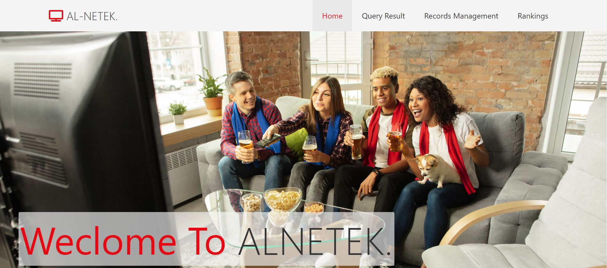

<h1 align='center' style="text-align:center; font-weight:bold; font-size:2.5em"> Media Company Website (with data base)</h1>

<p align='center' style="text-align:center;font-size:1em;">
  


</p>


# Contents

- [Overiew](#Overiew)
- [Setup](#Setup)


# Overview
**Overiew**

|                     <h5 align='center' style="text-align:center; font-weight:bold; font-size:2.5em"> Home Page (with data base)</h5>                            | 
| :------------------------------------------------------ | 
|            |
# Full-Specifications
**Full-Specifications**
 [([ds_algs_specs.pdf](https://github.com/its-Raz/ds-algs/blob/master/ds_algs_spec.pdf))]
 
 # Setup
**Setup**

1. Clone this repository and 

   ```bash
   git clone https://github.com/its-Raz/ds-algs.git
   
   ```
2. Run ```Test.java```
3. Compare ```my_output.txt``` to ```test_output.txt```
# Full-Specifications
**Full-Specifications**
 [([ds_algs_specs.pdf](https://github.com/its-Raz/ds-algs/blob/master/ds_algs_spec.pdf))]
